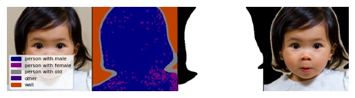
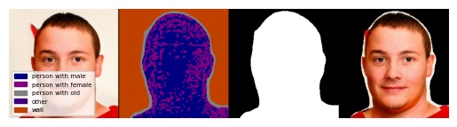

# Language-driven Semantic Segmentation (LSeg) + StyleGAN2
This repository aims to use [LSeg](https://arxiv.org/abs/2201.03546) (Li et al., ICLR 2022) with [StyleGAN2](https://arxiv.org/abs/2201.03546) (Karras et al., CVPR 2020)

## Usage
### Installation

```
conda create -f environment.yaml
conda activate lseg
pip install timm==0.9.16
```

### Download Model Weights

1. Download LSeg weights from [Pretrained weights](https://drive.google.com/drive/folders/1h_8o-E2DBtgZDqH20wupW9FiyCP7T-m2)
2. Put the downloaded weights under folder checkpoints as checkpoints/demo_e200.ckpt.

- Note that above weights containts model weights from <a href="https://drive.google.com/file/d/1ayk6NXURI_vIPlym16f_RG3ffxBWHxvb/view?usp=sharing">Originral Pretrained Weights</a> from [Official LSeg Github](https://github.com/isl-org/lang-seg?tab=readme-ov-file#download-demo-model).
- Directly utilizing the author provided weights needs complicated environment setup.
- I just loaded the author provided weights and save the model state dict only.

### Data Preparation

1. Dataset Version

- Prepare dataset (FFHQ / LSUN-CHURCH / LSUN-BEDROOM / AFHQ-CAT / AFHQ-WILD) following instructions in official StyleGAN2-ADA github repository, [StyleGAN2-ADA Dataset Preparation](https://github.com/NVlabs/stylegan2-ada-pytorch?tab=readme-ov-file#preparing-datasets)

- I only tested datasets with resolution 256x256px.
- You may use LSUN-CAT pre-trained models with AFHQ-CAT settings.

2. StyleGAN2 generated samples

- Prepare pre-trained StyleGAN2 model weights from [FFHQ256x256](https://nvlabs-fi-cdn.nvidia.com/stylegan2-ada-pytorch/pretrained/transfer-learning-source-nets/) or [LSUN-CHURCH256x256](https://nvlabs-fi-cdn.nvidia.com/stylegan2/networks/)

- I tested pre-trained models with 256x256 px resolutions from above two links. For AFHQ-CAT, AFHQ-WILD, I used manually trained models.
- You may use LSUN-CAT pre-trained models with AFHQ-CAT settings.


### Generate Segmentation / Mask

1. Dataset Version

- Fill in --dataset_path in **generate_cams.sh**
  ```
  python generate_cams_dataset.py --dataset ffhq --dataset_path /path/to/ffhq_dataset --save_path segmentation/ffhq --mask
  ```

2. StyleGAN2 generated samples

- Fill in --network in **generate_cams_stylegan2.sh**
  ```
  python generate_cams_dataset_stylegan2.py --dataset ffhq --network /path/to/stylegan2-ffhq-network --save_path segmentation_stylegan2/ffhq --mask
  ```

### Examples

#### FFHQ Dataset Segmentation



#### FFHQ StyleGAN2 Samples Segmentation



## Citations
```
@inproceedings{
li2022languagedriven,
title={Language-driven Semantic Segmentation},
author={Boyi Li and Kilian Q Weinberger and Serge Belongie and Vladlen Koltun and Rene Ranftl},
booktitle={International Conference on Learning Representations},
year={2022},
url={https://openreview.net/forum?id=RriDjddCLN}
}
```
```
@inproceedings{Karras2020ada,
  title     = {Training Generative Adversarial Networks with Limited Data},
  author    = {Tero Karras and Miika Aittala and Janne Hellsten and Samuli Laine and Jaakko Lehtinen and Timo Aila},
  booktitle = {Proc. NeurIPS},
  year      = {2020}
}
```


## Acknowledgement
This repository heavily depends on [LSeg](https://github.com/isl-org/lang-seg), [StyleGAN2-ADA](https://github.com/NVlabs/stylegan2-ada-pytorch), [CLIP](https://github.com/openai/CLIP)
